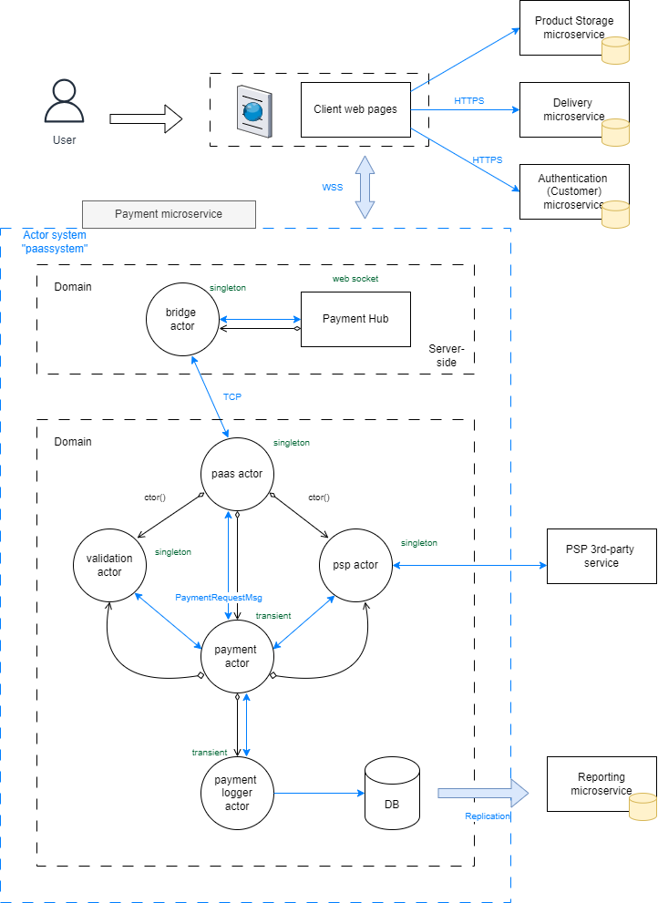

# High level architecture

## Actor system

Actors are objects which encapsulate state and behavior. They communicate exclusively by exchanging messages which are placed into the recipient’s mailbox.  
In a sense, actors are the most stringent form of object-oriented programming, but it serves better to view them as persons: while modeling a solution with actors, envision a group of people and assign sub-tasks to them, arrange their functions into an organizational structure and think about how to escalate failure.  

Reactive manifesto

## Microservices

### Web store

Blazor web application containing both server-side and client-side parts.  
Server-side part hosts the application and runs websocket communication with a user.  
Client-side connects to websocket and reads/writes data.  
Client-side loads data for the store from Product storage microservice to show available products.  
Client-side also requires a user to be registered on the site and be authenticated. It is needed to keep user communication during payment and delivery.
Server-side also connects to the actor system to read/write messages from payment microservice.  
As well as other services, is integrated in te actor system.

### Payment microservice

It is a console application, which connects to the actor system. Creates actors to handle payments and store this information in log.  
Creates a payment in memory and uses finite state machine to process different payment statuses.  
Mocks PSP integration as well as payment validation for simplicity sake.

### Lighthouse

Lighthouse is a simple service-discovery tool for Akka.Cluster, designed to make it easier communication between actors within the same system.  
Lighthouse runs on a static address and is not updated during deployments of other actor services in cluster.